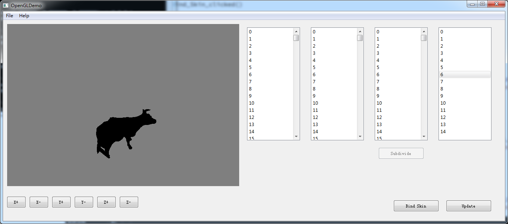

# CIS_560_HW7

## Q&A
Q: (5 pts) What visual errors may occur when using linear blend skinning for a mesh? Why do these errors occur?

A: Candy warp effect. When twisting joints in a large angle, the mesh will collapse to the joint. This happens because the mesh volume is not considered! 

Q: (5 pts) Since one cannot insert breakpoints into a GLSL shader program, how might one debug a shader? For example, if one were writing a vertex shader that applies a mesh skinning deformation, how might one determine which vertices are influenced by a particular joint? Consider what alterations to your fragment shader might be useful to test this.

A: We can use color to present the data. For this example, we could add colors(black and white) to each vertex. The larger the influence weight is, the brighter it can be. 

## Features:

#### First, click "Bind Skin" button, then click "Update" so you can rotate the cow. 
#### Do NOT rotate before binding, or it will crash! 

You may click on any objects in the right most list to see its rotation. The rightmost list is joint list. The informations are printed in the cmd window.

### Things I added in this project: 

1. Skeleton class.

Skeleton class will read the skeleton json, build up the skeleton, and update it when some transformations are done to the bones.

##### The address of the skeleton json is hardcodes, so please put it in the builded folder! 

2. Joint class.

Joint class describes each joint, and for each of the joints, it gives the transform out. When binding and rotating, the vertices will visit the joint(s) they are binded to.

3. Mesh::bind_skin(Skeleton skeleton)

This function will take in the skeleton as input, and bind it to the mesh. If the binding has some errors, it will return false. 

Currently I only have the naive binding working. 

I apologyse to make the half_edge.cpp even longer, but this should be one of the Mesh functions. 

4. Mesh::update_Vertices(Skeleton s)

Another function in half_edge.cpp, I apologyse again. This function will take the skeleton as input, and update vertices positions. 

5. mainwindow.cpp

A lot of buttons are added here. The float degree controls how many degrees the bone will rotate when selected, by default it is 5 degrees. 

### Bugs: 

1. The glsl updating is not working, -30 points. 

2. Visualizing bones are not working, same problem as before. And I used the cmd lines to debug, again...

### Comments: 

To summarize, the most difficult thing in all these homeworks is: dealing with Qt. I never used Qt before, and I sincerely wish I would never need to use it anymore in my life. 

Another thing is about visualization. The GL:Draw is out of date, and it is no longer supported. 

Last thing is the out-dated GLM we have. It has some problems with quaternions. A quaternion should be like w i j k, but in this old version of GLM it is stored as i j k w. 
